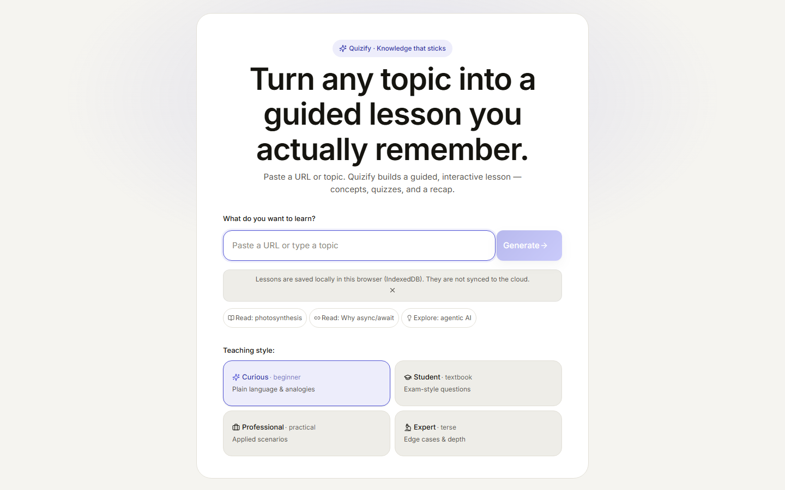
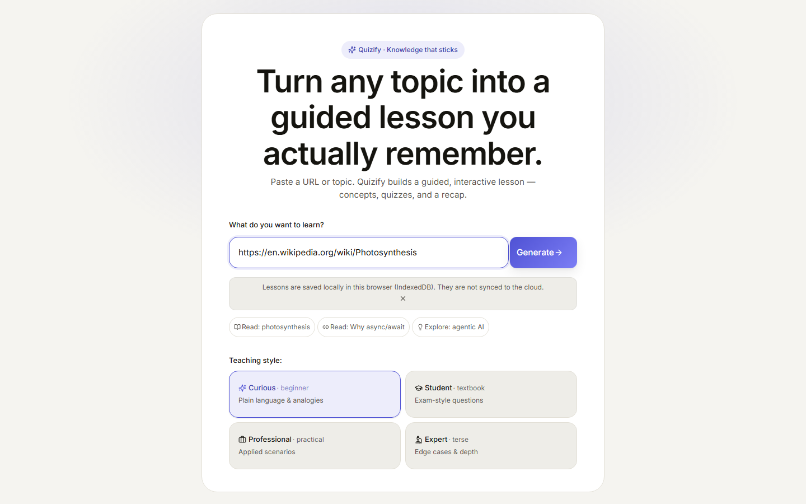
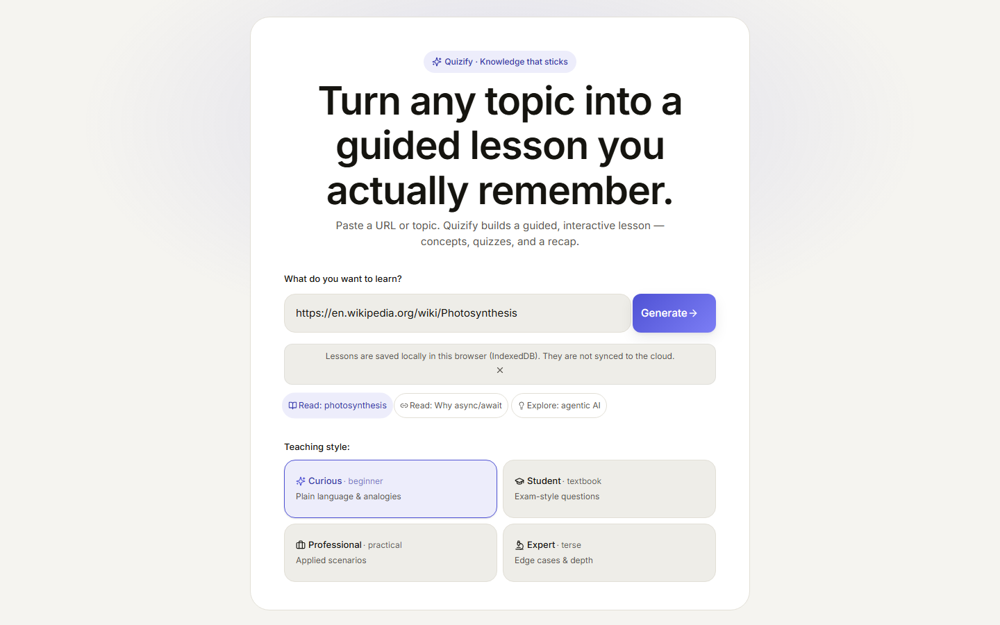
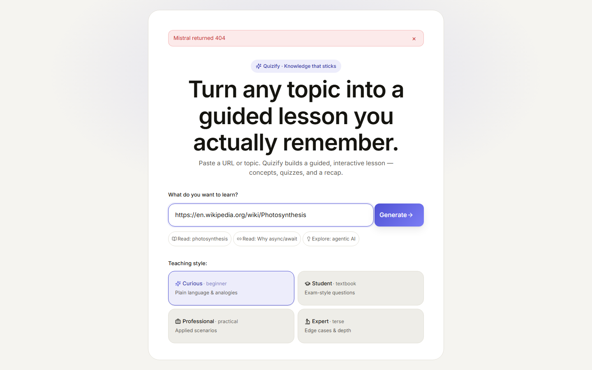
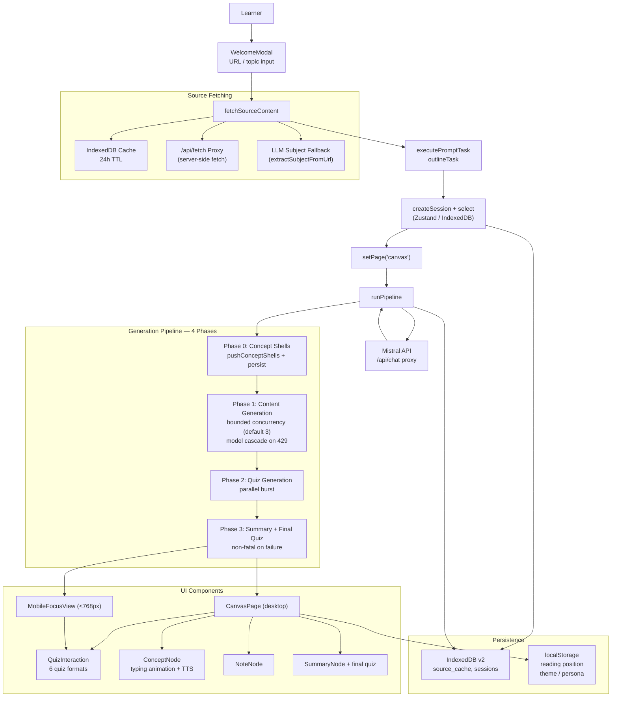

# Quizify

**Turn your material into knowledge that sticks.**

Quizify is a source-grounded adaptive study coach for university students and self-learners. Paste a URL or topic and get a guided, interactive lesson — concept outlines, explanations, quizzes with immediate feedback, text-to-speech narration, and local-first persistence.

> **Codename:** Quizify will be rebranded before a broad public launch (see [`docs/roadmap.md`](docs/roadmap.md) for the naming sprint plan).
>
> **UX Decisions:** See [`docs/spec/ux-decisions.md`](docs/spec/ux-decisions.md) for approved product UX — do not change without confirmation.

---

## Overview

Students preparing for exams in content-heavy subjects (biology, psychology, history, business) often have piles of lecture slides, readings, and notes — but no structured path to durable recall. Quizify bridges that gap:

1. **Import** a URL, paste text, or type a topic
2. **Outline** is generated from the source via LLM
3. **Expand** each concept with explanations, examples, and quizzes
4. **Study** through a linear notebook with optional TTS narration and progression gating
5. **Resume** anytime — everything persists locally in IndexedDB

---

## Key Features

- **URL / topic input** — fetch web content or generate lessons from a subject
- **Source-grounded generation** — explanations and quizzes derived from your material
- **Concept outline** — auto-generated structure with source references
- **Interactive quizzes** — multiple choice, true/false, short answer, free text, fill-in-the-blank, ordering
- **Typing-animation narration** — concepts revealed with a typing effect for focused reading
- **Text-to-speech** — Web Speech API with optional server TTS fallback; play/pause/skip/speed controls
- **Notebook mode** — linear, progression-gated study flow with concept-level unlock
- **Mobile focus view** — dedicated mobile UI for small screens
- **Retry / skip failed concepts** — pipeline resilience with per-concept recovery
- **Local-first persistence** — IndexedDB via `idb`; no account required, works offline
- **Session resume** — pick up where you left off with saved reading position
- **Persona-based teaching style** — Curious, Student, Professional, or Expert
- **Dark / light / auto theme** — system-aware theme switching
- **Keyboard shortcuts** — `N` add note, `?` help, `Esc` close quiz
- **Export** — JSON and Markdown export of completed lessons

---

## Screenshots

| Welcome & Input | URL Filled | Chip Active | Canvas (Loading) | Canvas (Content) |
|---|---|---|---|---|
|  |  |  |  |  |

---

## Architecture



### Data Flow

1. **Input** — learner pastes a URL or topic in `WelcomeModal`
2. **Fetch** — `fetchSourceContent` tries IndexedDB cache → server proxy → LLM subject fallback
3. **Outline** — content is sent to Mistral via `outlineTask` to extract a concept outline
4. **Session** — `createSession` writes to IndexedDB, UI navigates to canvas
5. **Pipeline** — `runPipeline` executes 4 phases:
   - Push concept shells (immediate UI feedback)
   - Generate content for each concept (bounded concurrency, model cascade for rate limits)
   - Generate quizzes (parallel burst)
   - Generate summary + final quiz (non-fatal)
6. **UI** — `CanvasPage` (desktop) or `MobileFocusView` (mobile) renders the notebook
7. **Interaction** — quizzes open in `QuizInteraction` dialogs, grading is local (objective) or LLM-based (open answers)

---

## Tech Stack

| Layer | Technology | Rationale |
|---|---|---|
| **Runtime** | Vite 5 + React 18 + TypeScript 5.6 | Fast dev server, typed code, modern React patterns |
| **State** | Zustand 5 | Lightweight, no boilerplate, works outside React tree |
| **Persistence** | IndexedDB via `idb` (v8) | Offline-first, no backend required for MVP |
| **UI** | CSS Modules + custom properties | Scoped styles, dark/light theme support |
| **LLM** | Mistral API (server-proxied) | Task-specific model routing, retry/backoff/timeout |
| **Server** | Cloudflare Pages Functions | `/api/chat` (LLM proxy), `/api/fetch` (URL proxy) |
| **Fetch** | Server-side proxy + Vite dev proxy | CORS-safe, no external proxy dependencies |
| **Grading** | Local deterministic + LLM semantic | Objective formats graded client-side; open answers via LLM |
| **Testing** | Vitest + Testing Library + Playwright | Unit, integration, and E2E coverage |
| **Linting** | ESLint 9 + Prettier | Consistent code style |

---

## Getting Started

### Prerequisites

- Node.js 18+ (LTS recommended)
- npm 9+
- A [Mistral API key](https://console.mistral.ai) (free tier available)

### Setup

```bash
# Clone the repository
git clone https://github.com/your-org/quizify.git
cd quizify

# Install dependencies
npm install

# Configure environment
cp .env.example .env
# Edit .env and set your Mistral API key:
#   MISTRAL_API_KEY=m8_your_key_here

# Start the dev server
npm run dev
```

Open [http://localhost:5173](http://localhost:5173) in your browser. Paste a URL (e.g., a Wikipedia article) or type a topic, pick a teaching persona, and click **Generate**.

---

## Project Structure

```
quizify/
├── src/
│   ├── app/                  # App shell, page router, theme, progress screen
│   │   ├── App.tsx           # Page orchestrator (welcome/progress/canvas)
│   │   ├── ProgressScreen.tsx # Generation progress UI with Snake game easter egg
│   │   └── useTheme.ts      # Dark/light/auto theme hook
│   ├── features/
│   │   ├── canvas/           # Notebook UI (desktop + mobile)
│   │   │   ├── CanvasPage.tsx       # Main notebook with TTS, progression, recovery
│   │   │   ├── MobileFocusView.tsx  # Mobile-optimized reading + export
│   │   │   └── nodes/               # ConceptNode, QuizNode, SummaryNode, NoteNode
│   │   ├── quiz/             # Quiz interaction and grading
│   │   │   ├── QuizInteraction.tsx   # Dialog for answering quizzes
│   │   │   └── SummaryQuizInteraction.tsx
│   │   ├── toolbar/          # Top toolbar component
│   │   └── welcome/          # Welcome modal, persona selection
│   ├── lib/
│   │   ├── analytics/        # Local event ring buffer (expandable)
│   │   ├── components/       # Error boundaries, dialogs
│   │   ├── db/               # IndexedDB operations (source_cache, sessions)
│   │   ├── llm/              # LLM integration
│   │   │   ├── providers.ts  # Model routing, cascade, task configs
│   │   │   ├── chat.ts       # Retry/backoff/timeout/AbortSignal
│   │   │   ├── parsers.ts    # JSON response parsers
│   │   │   └── ttsManager.ts # TTS orchestration (Web Speech + server)
│   │   ├── prompts/          # LLM prompt templates
│   │   │   ├── outline.ts    # Concept extraction
│   │   │   ├── content.ts    # Explanation generation
│   │   │   ├── quiz.ts       # Question generation
│   │   │   ├── summary.ts    # Recap + final quiz
│   │   │   └── grade.ts      # Open-answer grading
│   │   ├── pipeline.ts       # 4-phase generation orchestration
│   │   ├── tasks/            # Prompt execution helpers
│   │   ├── fetchSourceContent.ts  # Source fetching (cache → proxy → LLM)
│   │   └── progression.ts   # Concept unlock logic
│   ├── shared/
│   │   ├── stores/           # Zustand stores
│   │   │   ├── sessionStore.ts   # Sessions + currentId (IndexedDB-backed)
│   │   │   ├── settingsStore.ts  # Persona, theme, TTS settings
│   │   │   ├── notebookStore.ts  # Notebook mode, typing progress
│   │   │   └── toastStore.ts     # Toast notifications
│   │   ├── types.ts          # Core type definitions
│   │   ├── learningProgress.ts   # Review/mastery scheduling (in progress)
│   │   └── useMediaQuery.ts  # Responsive hooks
│   └── styles/               # Global CSS variables and resets
├── docs/
│   ├── roadmap.md            # Canonical product strategy (12-month plan)
│   └── architecture.md       # System wiring reference
├── functions/
│   ├── api/chat.ts           # Cloudflare Pages Function — Mistral proxy
│   └── api/fetch.ts          # Cloudflare Pages Function — URL proxy
├── tests/
│   ├── setup.ts              # Vitest setup (jsdom, fake IndexedDB)
│   ├── e2e/                  # Playwright E2E tests
│   └── ...                   # Unit tests
└── screenshots/              # README screenshots
```

---

## Development

### Scripts

| Command | Description |
|---|---|
| `npm run dev` | Start Vite dev server (localhost:5173) |
| `npm run build` | TypeScript check + Vite production build |
| `npm run preview` | Preview production build locally |
| `npm run typecheck` | TypeScript type checking |
| `npm run lint` | ESLint across the project |
| `npm run format` | Prettier formatting |
| `npm run format:check` | Check formatting without writing |
| `npm test` | Run Vitest unit tests |
| `npm run test:e2e` | Run Playwright E2E tests |

### Pre-PR Checklist

```bash
npm run build && npm run lint && npm test
```

### Conventions

- **Path aliases:** `@/*` maps to `./src/*`
- **State:** Use Zustand updater form `set((state) => ...)` to avoid stale closures
- **Session store:** Always `await createSession` + `await select` before and after `runPipeline` (race condition)
- **Pipeline writes:** Concurrent persists are mutex-serialized (see `createMutex` in `pipeline.ts`)
- **Summary failure:** Intentionally non-fatal — the lesson works without it
- **No comments in source code** unless absolutely necessary for a non-obvious gotcha
- **i18n:** Not yet implemented — all strings are currently hardcoded in English

---

## Testing

**Unit & integration tests** use Vitest + jsdom + Testing Library:

```bash
npm test
```

**E2E tests** use Playwright against a seeded `dist/` build (no live LLM):

```bash
npm run test:e2e
```

Test files live in `tests/` alongside a few co-located component tests. E2E tests are in `tests/e2e/`.

---

## Known Gaps

These are documented limitations the roadmap plans to address:

- **`sourceReference`** exists on `ConceptData` but is not yet populated end-to-end (citations are a Phase 1 requirement)
- **Scheduler** in `learningProgress.ts` is incomplete — completed concepts must re-enter spaced review
- **Gateway hardening:** `/api/chat` and `/api/fetch` lack auth, quotas, SSRF limits, and body size caps (Phase 0 requirement)
- **TTS server function** (`/api/tts`) may be missing — client falls back to Web Speech API
- **Analytics** are a minimal local ring buffer — full funnel/cost/quality telemetry is planned
- **Model routing** is server-owned; clients are not allowed to choose arbitrary models

---

## Contributing

1. Read [`docs/roadmap.md`](docs/roadmap.md) for product direction and [`AGENTS.md`](AGENTS.md) for the agent cheat sheet
2. Open an issue or PR — no direct pushes to `main`
3. Follow existing code conventions (see [Development](#development))
4. Ensure `npm run build && npm run lint && npm test` passes before submitting

---

## License

MIT — see [LICENSE](LICENSE) (if one exists) or the repository settings.
