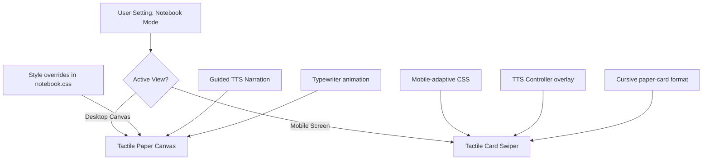

# UX Design Audit & Alignment Strategy: Quizify
*Authored from the perspective of a Principal Designer*

This audit reviews Quizify’s layout paradigms—**Standard Canvas (Non-Notebook)**, **Tactile Notebook**, and **Mobile Focus View**—identifying UX friction, aesthetic opportunities, and proposing a framework to keep them visually and interactively unified.

---

## 1. Executive Summary & Design Philosophy
Quizify is built on a sensory and tactile concept: translating dense linear articles into structured, draggable spatial nodes. 
* **Standard Canvas** represents *digital modularity* (infinite glassmorphic canvas, structured paths).
* **Notebook Mode** represents *tactile familiarity* (guided narration, cursive ink on ruled paper).
* **Mobile View** represents *focused consumption* (card-based linear swipes).

To achieve "Apple-level" design maturity, the transitions between these views must feel like a single material folding and shifting, rather than three disconnected interfaces. 

---

## 2. Friction Points & UX Audit

### A. Desktop: Standard Canvas View
| Current Implementation | Critique & Apple Design Standard | Proposed Improvement |
| :--- | :--- | :--- |
| **Draggable Layout**: Nodes are spaced out horizontally but remain free-form. | Lacks structural alignment when nodes are repositioned; can become disorganized. | Introduce soft grid snapping and a "Tidy Up" animation (smoothly aligning nodes via spring physics). |
| **Note Creation**: Notes spawn at the viewport center with standard visual cards. | Standard visual styles match the note card exactly, making sticky notes feel like code modules. | Keep sticky notes physically distinct from concepts and quizzes. Make them look like semi-translucent post-its with subtle rotated dropshadows. |
| **Interactive Connections**: Uses `@xyflow/react` wiggly lines. | The wiggly lines are wonderful but lack interactive feedback. | Animate the path stroke (e.g., subtle dash arrays flowing along the connection path) to represent progress. |

### B. Desktop: Notebook View
> [!WARNING]
> **Critical Usability Bug: The Navigation Trap**
> Currently, the action row (containing the toggle to exit Notebook mode) is completely hidden when `notebookMode` is active (`display: none` in `CanvasPage.tsx` line 401). The user is trapped in Notebook mode with no visual way to exit.

| Current Implementation | Critique & Apple Design Standard | Proposed Improvement |
| :--- | :--- | :--- |
| **Tactile Metaphor**: Background uses repeated linear horizontal grid lines. | Lacks the iconic margin line that defines paper. The gray canvas background feels dull. | 1. Add a vertical pinkish-red margin line at the left side of the paper.<br>2. Shift the canvas background to a warm cream-colored texture (`#FAF8F5`) in light theme. |
| **Typographical Overreach**: Every element (including buttons, badges, counts, and TTS progress text) switches to the cursive `Caveat` font. | Lowers legibility and breaks the illusion. Physical notebooks contain *printed* UI components and *written* notes. | Restrict `Caveat` to headings, body paragraphs, and note contents. Keep UI elements, buttons, and progress counters in `Inter` (sans-serif) for professional polish. |
| **TTS Controls State**: The TTS playback controls overlay disappears when audio stops (`!ttsPlaying && !ttsPaused`). | Users have no way to replay, scrub, or exit the guided narration once it finishes. | Transition the play/pause bar into a persistent, elegant "Journal Controller" HUD. |

### C. Mobile Focus View (`MobileFocusView`)
| Current Implementation | Critique & Apple Design Standard | Proposed Improvement |
| :--- | :--- | :--- |
| **Aesthetic Disconnect**: Mobile does not support "Notebook mode" styling. If notebook mode is toggled, mobile remains in a standard gray sans-serif layout. | Violates the rule of cross-device experience consistency. | Render the mobile cards with notebook aesthetics (cream paper background, red margin, cursive headings, typewriter text animations) when notebook mode is active. |
| **Linear Gating**: Users must swipe one node at a time. | Hard to get an overview of the outline or skip ahead. | Create a bottom sheet outline list (drawer) to jump to any concept instantly. |
| **TTS Parity**: TTS auto-plays on card switches but has zero playback controls or pause buttons. | Users cannot pause or silence narration without turning down their system volume. | Add a miniature player control bar at the bottom of the card or in the header. |

---

## 3. The Unified Consistency Framework

To bridge the Desktop and Mobile views, we propose a unified state model and a layout translation system.



### A. Typographical Hierarchy Rules
To keep views polished, we divide text into **Written Content** (Cursive) and **Printed interface** (Sans-Serif):

```
+-------------------------------------------------------------+
|  [Concept 1: Neural Networks]                 (UI - Inter)  |
|                                                             |
|  How Brains Learn                              (Script-Caveat)
|  ---------------------------------------------------------  |
|  Neural networks mimic biological neurons...   (Script-Caveat)
|  They adjust weights iteratively...                         |
|  ---------------------------------------------------------  |
|                                                             |
|  [  Listen  ]      (Button - Inter)      [ 1 / 4 Attempts ] |
+-------------------------------------------------------------+
```

### B. Shared HUD Design (Exit/Play/Pause Controller)
Rather than hiding the action row on desktop or omitting controls on mobile, both views should use a floating capsule HUD.

* **Canvas HUD (Normal)**:
  `[ + Add Note ]  [ ↥ Export ▾ ]  [ 📖 Study Mode ]`
* **Journal Voyage HUD (Notebook Active)**:
  `[ ✕ Exit Journal ] | [ ◀ Prev ] [ ■ Stop ] [ ▶ Play ] [ ▶▶ Next ] | [ Page 2 of 5 ]`

---

## 4. Visual Polish Specifications (CSS & Physics)

### I. Warm Cream Paper Texture (Light Theme)
In `notebook.css`, replace the background rules to add the red margin line and warmth:
```css
[data-notebook="true"] .react-flow__background {
  background-color: #FAF8F5 !important;
  background-image: 
    /* Pink margin line */
    linear-gradient(90deg, transparent 89px, rgba(220, 38, 38, 0.25) 89px, rgba(220, 38, 38, 0.25) 91px, transparent 91px),
    /* Blue ruled lines */
    repeating-linear-gradient(transparent, transparent 27px, rgba(84, 87, 232, 0.08) 27px, rgba(84, 87, 232, 0.08) 28px) !important;
  background-size: 100% 100%, 100% 28px;
}
```

### II. Fluid Transition Animation
Ensure that switching between standard and notebook mode does not cause layout jumps:
```css
/* Apply to node containers */
.react-flow__node {
  transition: 
    background-color 0.4s var(--ease-out),
    border-color 0.4s var(--ease-out),
    box-shadow 0.4s var(--ease-out),
    transform 0.4s var(--ease-out) !important;
}
```

### III. Sticky Notes Aesthetics
Ensure that NoteNode stickies maintain their physical charm (folded corners and angle variation) in both modes.
* Angle variation: Note nodes should get random rotational slants (e.g. `rotate(-1.5deg)` to `rotate(1.5deg)`) on load to look hand-placed.

---

## 5. Walkthrough of Consistency Implementation Steps
1. **Fix the Navigation Trap**: Update `CanvasPage.tsx` so the floating controls bar (or a segment of the actions row) remains visible to allow toggling out of Notebook mode.
2. **Standardize Font Rules**: Edit `notebook.css` to exclude buttons (`.actionBtn`, `.playButton`), counts, progress label, and badges from the cursive `Caveat` font, restoring high-legibility `Inter`.
3. **Synchronize Mobile State**: Extend `MobileFocusView.tsx` to read the `notebookMode` state, applying warm background styling, paper texture, custom cursive classes, and showing the TTS player bar.
4. **Enrich Notebook Skeuomorphism**: Add the margin line and the warm background color to the CSS rules under `[data-notebook="true"]`.
